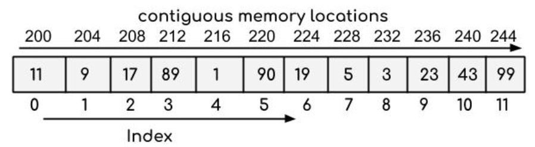
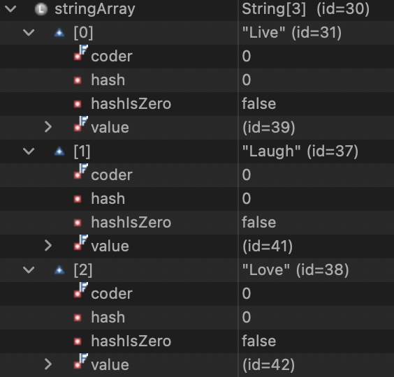
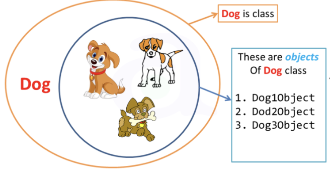
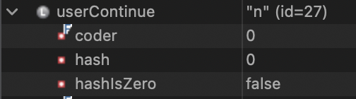

# Technical Documentation CS2050 #

**Table of Contents**
- [Module 01](#module-01-programming-and-object-oriented-fundamentals)
- [Module 02](#module-02-arrays-searching-sorting-and-algorithm-analysis)

## Module 01: Programming and Object-Oriented Fundamentals ##

- [Control Structures](#control-structures)
    - [Conditional](#conditional)
    - [Switch](#switch)
    - [Loops](#loops)
- [Arrays](#arrays)
- [Classes and Objects](#classes-and-objects)
- [Method Overloading](#overloading)
- [Inheritance](#inheritance)
- [Method Overriding](#overriding)
- [Memory Allocation](#memory)
- [Static vs Instance Methods](#static-vs-instance-methods)

### Control Structures ###

Control structures are how we "control" the logic that a program will follow. I know, self explanatory right?

There are a few different types that we use in object oriented languages.

#### Conditional ####

Also called an `if/else` statement. This type of logic flow changes depending on what type of input it receives. We use this type of control when we are testing inputs based on **boolean expressions**.

```java
if (grade < 60)
{
    System.out.println("Come to office hours")
}
else
{
    System.out.println("Passed")
}
```

In the case above, if someone is failing the system prompts them to come to office hours. If not, it tells them they passed.

There are two different types of if statements; *nested* and *multi-way*

*Nested* statements follow a sequence of if statements. Once you go into one if statement, you go right into another. It is a **series** of choices that the program is making based on inputs.

*Multi-way* statements is based on **one** input. Based on that input, different outputs can occur. The program will follow sequentially down until it finds something that is true and then it will *exit*.

```java
if (grade >= 90)
{
    System.out.println("You got an A");
}
else if (grade >= 80)
{
    System.out.println("You got a B");
}
else if (grade >= 70)
{
    System.out.println("You got a C");
}
else
{
    System.out.println("Take the class again");
}
```

This is looking at the one value of `grade` and checking it against each condition.

#### Switch ####

These are used when we are matching **exact values** of an input.

```java
switch (choice)
     {
        case 'A':
           System.out.println("You entered A.");
           break;
        case 'B':
           System.out.println("You entered B.");
           break;
        case 'C':
           System.out.println("You entered C.");
           break;
        default:
           System.out.println("That's not a choice!");
     }
```

#### Loops ####

There are a few different types of loops, but generally speaking, a loop is a control structure that will repeat itself until some condition is changed/met. 

**While**

While loops will first check if a *boolean* expression is `true`, if it is, then it will enter the loop. It will continue through the loop until the condition is changed to `false`

```java
while (number1 + number2 != answer) {
      System.out.print("Wrong answer. Try again. What is " 
        + number1 + " + " + number2 + "? ");
      answer = input.nextInt();
    }
```

In the case above, the loop will keep repeating until the user inputs the correct sum to the equation.

**Do While**

This loop functions the same as a while loop, but it will execute **at least** once. While loops have the ability to be bypassed whereas do while *has* to execute at least once.

```java
//do while loop will execute once then check condition 
do 
{	
	//Changes the loop control variable
	counter++;	
	System.out.printf("Count is %d \n",counter);
				
} while (counter <= 5); //checks condition
```

**For Loop**

Used when you have an **exact** amount of times that you want a loop to execute.

```java
for (int i = 0; i <= 2; i++) 
{
   System.out.println("This is iteration " + i + " of the for-loop");
}
```

The above code is initializing the variable, setting a boolean expression, and setting an increment. This can be used for counters.

### Arrays ###

An array is a type of data structure that hold values of the **same** data type in a sequential order on the **heap**

What is the heap? It's a place where data is stored *outside* of the stack frame that methods are placed housed in. So we put data on the heap that we want to persist past the life of a method.

Items that are stored on the heap have an **address** within the program itself. So we are not storing the actual data on the stack, just an address that points to the stack.

**1D Arrays** can hold only *primitive* data types. 

At index `[1]` there is `int` 9.



**2D Arrays** get really spicy because we are holding *non-primitive* data types. I also like to call this one ~array-ception~

They are essentially like a table that you may find in excel or any part of your day to day life.



As you can see, each spot in the array holds an **id** that points to a *different* spot on the heap which holds even more information.

Iterating through a 2D array often require a *nested for loop*

```java
public static void display2DArray(double current2DArray[][])
{
	for (int row = 0; row < current2DArray.length; row++)
	{
		for (int col = 0; col < current2DArray[row].length; col++)
		{
			System.out.printf("[%d][%d]: %.2f   ",row, col, current2DArray[row][col]);
		}
		System.out.println("");
	}
}
```

So you have the **outer** loop counting the rows and the **inner** loop counting the columns. We are utilizing the for loops execution of completing the **inner** loop completely *before* starting the next outer loop iteration.

### Classes and Objects ###

So an object is an *instance* of a class. Meaning, that we may have a "dog" class, but then we have an object that is named Clifford the Big Red Dog. 

A class gives a **baseline** in which all objects created using it share similar attributes. It's often referred to as a blueprint.

Each dog can have individual characteristics, but they all have a breed, color, age, etc.

```java
Dog Clifford = new Dog(Vizlas, Red, 11);
Dog Spot = new Dog(Dalmation, White, 2);
```



**<ins>Vocabulary</ins>**

| Word | Meaning |
| -----| --------|
| Class | Used to construct an object |
| Object | Represents a **thing** |
| Instance | An object of a particular class |
| Instantiation | Creating a new object |

**Encapsulation**

This allows the *least* amount of access needed in order for someone to utilize our class. Also by using encapsulation, we can have everything for an object all in one place.


### Overloading ###

Method overloading is essentially allowing two **different** methods to share the same name but have different **parameters**

A solid example of this is constructors. 

```java
public Dog() {
    sitting = false;
    fetching = false;
}

public Dog(String dogName, String dogBreed, String dogColor) {
    name = dogName;
    breed = dogBreed;
    color = dogColor;
    sitting = false;
    fetching = false;
}
```

The first constructor will simply create space for a `Dog` object and put in "default" attributes. The second one allows the user to set their own attributes for the `Dog` object in addition to the defaults.

### Inheritance ###

Best practice in programming means using DRY(Do not repeat yourself) and SRP(Single responsible principle) techniques.

Inheritance is the personification of this principle. You may have a group of classes that are all unique, but share some attributes. We would have to do an awful lot of repeating in order to make sure all of the classes have the right info.

We can create a parent/super class that holds all of the **shared** information. Then create *child/sub classes* to get more into the specifics.


### Overriding ###

Method overriding is used when child classes may share the same attribute but execute it in different ways.


In the above picure, each shape all has the ability to `draw` but obviously you don't want the square to draw a circle. So, in the child class we **override** the default parent method to suit the use-case that we need.

### Memory ###

Memory primarily functions in two different spaces. The **stack** and the **heap**

The stack is our neat pile of plates that goes through phases called *pushing* and *popping*. The plates represent methods and all of the data that they store. Methods pop off the stack and into oblivian, so the information stored there is temporary and **cannot** be accessed after the method is done running.

The heap, on the other hand, is our messy pile of shit. It's full of information but it's kind of a big mess that you can't find anything in. *<ins>Unless</ins>* you have an address. 

You know how expo halls that host rodeos always have that smell of shit? 

**The heap of shit persists**



This cutesy little `id=27` is directing you to a spot on the heap. Now we know exactly where we need to go to get the information contained in the variable `userContinue`

### Static vs Instance Methods ###

There are two different types of methods that classes can hold. 

There is *instance* methods that a unique object can execute.

```java
student1.getName()
```

They are pretty clearly identifiable because an object has to be **already** instantiated to use it and they use the `dot` operator.

On the other hand, *static* variable do **not** need an instance of an object to execute. An excellent example of this is the `Math` class that Java has baked in.

```java
Math.sqrt()
```

```java
Student.getTotalStudents()
```

Static methods are typically utility/helper functions, and do not operate directly off of data that an object holds.

## Module 02: Arrays, Searching, Sorting and Algorithm Analysis ##

### CS 1050 Array Processing Code ###

Quick reference 1D array processing code from CS1050 (I guess you could probably tell that from the title huh...)

#### Find largest element ####

```java
int largest = numbers[0];
for (int i = 1; i < numbers.length; i++);
    if (numbers[i] > largest)
    {
        largest = numbers[i];
    }
System.out.println("largest = " + largest);
```

#### Initialize with Input Values ####

```java
Scanner input = new Scanner(System.in);
System.out.println("Enter " + numbers.length + " values: ");

for (int = 0; i < numbers.length; i++)
{
    numbers[i] = input.nextInt();
}
```

#### Display Array ####

```java
for (int i = 0; i < numbers.length; i++)
{
    System.out.println("numbers[" + i + "] = " + numbers[i]);
}
```

#### Sum Elements ####

```java
int sum = 0;
for (int i = 0; i < numbers.length; i++)
{
    sum += numbers[i];
}
System.out.println("sum = " + sum);
```

### Sorting 1D Arrays ###

#### Selection sort ####

Sorting algorithm in which each value, one at a time, is placed into its final sorted position in the list.

Essentially, whatever `index[i]` you are on is compared individually to the rest of the list to see if it is less than your original `i`. If it is, it's flagged. This continues down the whole array and then whatever is the actual lowest gets swapped with the original `i`. The searchable space **decreases** with every pass.

It’s like sorting a pile of rocks by size:
- Each round, you scan the pile, find the **largest** rock, and put it in the sorted line.
- Keep repeating until no rocks are left.

(chatgpt)

#### Bubble sort ####

Sorting algorithm in which values are repeatedly compared to neighboring elements in the list and their positions are swapped if they are not in the correct order relative. 

Bubble sort is super inefficient and will likely never be used unless a rare use case pops up.

#### Insertion sort ####

Sorting algorithm in which each value, one at a time, is inserted into a sorted subset of the entire list.

At each index `i`, take that element (the key) and compare it backward through the already-sorted portion of the list (`0` to `i-1`). Shift larger elements to the right until you find the correct spot, then insert the key there. This repeats until the entire array is sorted. The searchable space **increases** with every pass.

Think about how you might sort a hand of playing cards:
- You pick up cards one by one.
- For each new card, you look at the cards already in your hand (which are already sorted).
- You place the new card in the correct spot among those sorted cards.

By the time you’ve placed all the cards, your whole hand is sorted. (courtesy of chatgpt)

### Searching 1D Arrays ###

Ok, that was a lot of yapping about different ways to sort arrays. But, it's important to help understand *searching* arrays.

Searching through something is a hell of a lot easier whenever everything is already in perfect order.

#### Linear Search ####

But first, a quick detour into a search method that does **not** require the array to be pre-sorted.

In linear searches, the algorithm evaluates each individual slot, one at a time, *linearly* until it finds its' match. This is relatively inefficient because the amount of execution time grows with every slot added to an array.

I thought this was a clever way to validate whether or not you should return the index you're at: When a match is found that index of the match is returned, otherwise a -1 is returned.

This makes a lot of sense because an array's index can **never** be negative. So when a negative number is returned it indicates that what you are searching for is **not** present in the array.

```java
public static int linearSearch(int[] list, int key) {
    for (int i = 0; i < list.length; i++) {
      if (key == list[i])
        return i;
    }
    return -1;
  }
```

#### Binary Search ####

Next up, we have binary search. I love this search method so much it just makes a lot of sense to me.

An important thing to note: for this search algorithm to work the array **must** be presorted.

The way that I like to visualize this is how the CS 1 class at Harvard University's online course explains it.

Imagine you have a phone book and you are looking for John's phone number. You open to roughly the halfway mark and see where you are in the alphabet. We are on Mike. We know that John will be before Mike, or to the left, so we can immediately not search the right half and throw it away. We open to halfway again and we land on Ellen. Well, John is to the right of Ellen so we can throw out the left side. We keep doing this until eventually we reach John.

Or in more code-y language:
- If key is less than "middle" element, then only search for key in 1st half of array
- If key is equal to "middle" element, return match!
- If key is greater than "middle" element, then only search for key in 2nd half of array
- If no match is found, return -1

Luckily for us, the `Arrays` class that is baked into Java comes *with* a binary search method. You can call this at any time, even without first creating an object because it is a [static](#static-vs-instance-methods) method.